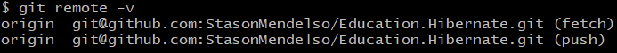

# Education.Hibernate

## What is the project about?

Repository is for educational purpose - learning a Hibernate framework.
I am watching the [course][1] about Spring framework, where the topic of Hibernate is attached,
making some notes and adding them to the project, writing examples from the
videos and mastering my skill in this framework.

## What is the purpose of this project?

The **purpose** of the project is ***learning basics*** about the Hibernate framework,
how it should be used correctly to get the *most benefit*. As for me, I haven't got
almost any experience of using any [ORM framework][2] and now want to try it instead of using
the [JDBC][3] in the applications.

## Getting Started

As there isn't a real or PET project, for viewing the all notes, which were made
during my study, you can switch between branches, commits and see my notes, some examples
of code for each lesson.

### Prerequisites

For running some branches of the projects you need the next:

* [PostgreSQL 15](https://www.postgresql.org/) - for running the app with database.
  You can find the [script](database/dump.sql) of creating database in directory with name "*[database](database)*".

### Installation Instruction

#### How to download project on my local machine?

For downloading the project locally you can use two variants:

1. Download the ZIP archive from the repository page.

   The method is easy, the next steps helps you:
1. Find the button `Code` and press it.
2. Find the button `Download ZIP` and press it. The downloading must start.
3. Unzip the archive in soe directory and run the IDEA in this directory.

Project has been installed. After opening it in your IDEA, the `Maven` downloads
some additional dependencies.

1. Use the `Git` for downloading the repository locally.

   The method a lit bit difficult, but the project will be downloaded with the help
   of several commands, and not manually, as in the previous method. For this method
   you **need** to [install][4] the `Git Bash` on your computer, make some configuration and have a primary skill of
   using this system of version control.
2. Enter your [name][5], [email][6] of GitHub account locally on your machine.
3. Create an empty directory and initialize it as git repository. Use the next
   command - `git init`.
4. Adds this repository to yours with name `origin` (you can change it, if you want):
    ```
   $ git remote add origin git@github.com:StasonMendelso/Education.Hibernate.git
   ```
   But you need configure your SSH connection to your GitHub profile in Git Bash. See more [here][7].

   For viewing that the repository has been added successfully to your local
   repository, you need execute the next command and get the following result:
   ```
   $ git remote -v
   ```
   

   After this step your local repository has got a 'connection' to the remote
   project from the GitHub repository.
5. For downloading the project use the following command:
   ```
   $ git pull origin main
   ```
   After these steps your project directory must contain the project files from
   GitHub repository. In addition to, you can create a new branch, make some
   changes and create a pull request for suggesting your improvements. Also, all
   changes are observed by the `git` and you can always make a rollback of
   all changes `git reset --hard`.

#### What things you need to install the software and how to install them

##### Database configuration

For running the database you can use as me PostgreSQL or create your own database on another SQL server(**not
recommended**)
using the [script](database/dump.sql) file of creating the database.

**Note**: if you use another server not such PostgreSQL
you should change JDBC driver for working with it and configurate the connection to your server in
properly [hibernate file](/src/main/resources/hibernate.properties) by changing configuration of connection.
This file contains only keys for configuration the Hibernate, so you can put your values to the file and run
application with this database configuration.

## Built With

* [Maven](https://maven.apache.org/) - Dependency Management

## Author

* **Stanislav Hlova** - *All work* - [StasonMendelso](https://github.com/StasonMendelso)

[1]:https://www.udemy.com/course/spring-alishev/

[2]:https://en.wikipedia.org/wiki/Object%E2%80%93relational_mapping

[3]:https://en.wikipedia.org/wiki/Java_Database_Connectivity

[4]:https://git-scm.com/downloads

[5]:https://docs.github.com/en/get-started/getting-started-with-git/setting-your-username-in-git

[6]:https://docs.github.com/en/account-and-profile/setting-up-and-managing-your-personal-account-on-github/managing-email-preferences/setting-your-commit-email-address

[7]:https://docs.github.com/en/authentication/connecting-to-github-with-ssh